# ShipSpec Two-Minute Demo

This is the short demo story for ShipSpec.



## Script

1. Start from a Jira item or feature request.

```bash
gsd run "https://example.atlassian.net/browse/AUTH-42"
```

2. Let Agentic RAG find the files and evidence.

```bash
gsd rag "AUTH-42 login page affected files"
```

3. Hand the mission to Codex without pasting long context.

```bash
gsd codex
```

4. After implementation, verify and ship.

```bash
gsd ship
```

The point: ShipSpec keeps the mission, context, skill route, verification evidence, and review report inside the repo.
